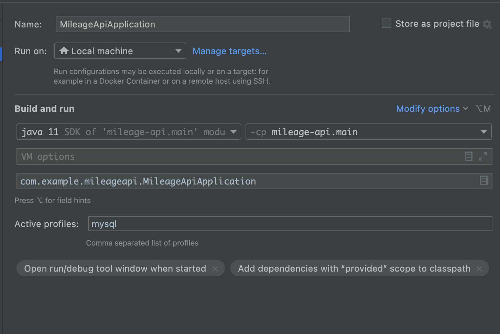

## 프로젝트 실행



프로젝트를 실행을 하기 위해서는 `Active Profile` 을 `mysql` 로 넣어 주어야 한다.

## MySql

1. 도커 파일 build

프로젝트의 Root Path 에서 Dockerfile 을 빌드 한다.

```
docker build -t mysql_custom:laster ./docker/.
```

2. 도커 이미지 컨테이너로 Run

```
docker run --name mysql_custom -d -p 3306:3306 mysql_custom:laster
```

## 설명

`POST /events` 이벤트 발생 되는 api 를 통해서 type 이 review 라면 마일리지의 증감 로직이 발생이 됩니다.

또한 type 별로 ADD , MOD , DELETE 각각의 로직에 따라 마일리지가 증감하게 됩니다.

총 나의 마일리지를 관리하는 테이블 Mileage 이 존재를 하며 마일리지 히스토리를 관리하는 Mileage_history 테이블 두가지로 구성을 하였습니다.

## API

```
 나의 포인트 조회 API

 GET
 http://localhost:8080/my-mileage?userId=유저의 아이디
 
 response 
 {
    "userId" : "xxx-xxxx",
    "point" : 10,
 }
```

```
 나의 포인트 히스토리 조회 API

 GET
 http://localhost:8080/my-mileage-histories?userId=유저의 아이디&size=10&page=0
 
 response 
 {
    "content" : [{
                    "id" : 0,
                    "reviewId" : "xx-xx-xx",
                    "type" : "CONTENT_ADD",
                    "placeId" : "xxx-xxx-xxx",
                    "point" : 0,
                    "userId" : "xxx-xxx-xx"
                 }]
 }
```
